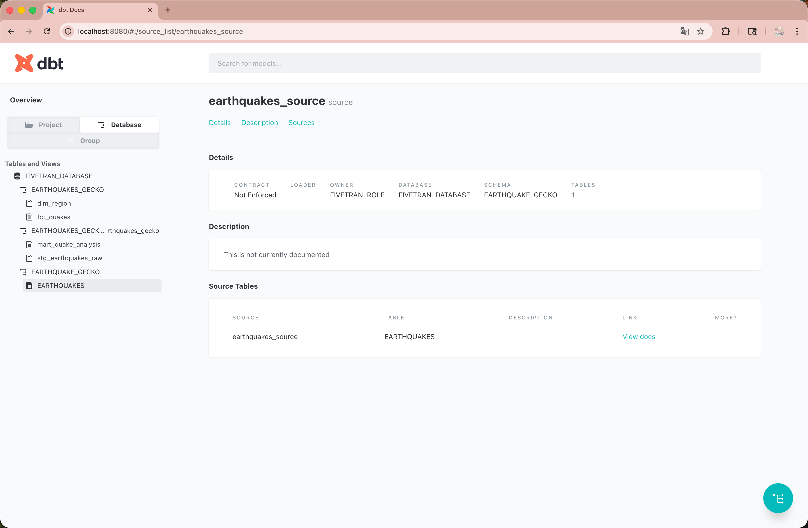

# USGS Earthquake API

o Endpoint: https://earthquake.usgs.gov/earthquakes/feed/v1.0/summary/all_month.geojson

Github folder structure
project/
│
├── earthquakes_connector/ ← Fivetran SDK custom connector
│ ├── connector.py
│ ├── requirements.txt
│ ├── files/
│ └── logs/
│
│ mds_project/
│ │
│ ├── dbt_project.yml
│ ├── profiles.yml (NOT UPLOADED)
│ ├── models/
│ │ ├── staging/stg_earthquakes_raw.sql
│ │ ├── marts/mart_quake_analysis.sql
│ │ └── schema.yml
│ │
── README.md
── screenshots/
│ │── fivetran_connection.png
│ ├── snowflake_raw.png
│ ├── snowflake_mart.png
│ └── dbt_docs.png

# Flow Pipeline:

USGS API
↓
Python (Fivetran SDK connector)
↓
Fivetran ingestion
↓
Snowflake Raw Table
↓
dbt transformations (stg → dim → fct → mart)
↓
Snowflake Marts (clean analytical tables)
↓
Tableau Dashboard

# dbt Models:

• stg_earthquake_raw — parse GeoJSON, clean timestamp, convert coordinates
• dim_region — map coordinates → region/country
• fct_quakes — magnitude bins, depth bins, daily counts
• mart_quake_analysis — final model for visualizations

# Visualisation from Tableau:

1. Global Earthquake Map (Choropleth / Bubble Map)
   Description:
   A world map displaying all earthquakes within the selected timeframe (e.g., past 30 days). Each earthquake appears as a circle marker placed at its latitude/longitude, where:
   • Size = magnitude (larger circle = stronger earthquake)
   • Color = depth category (e.g., shallow = yellow, deep = red)
   Insight / Purpose:
   • Shows geographic concentration of seismic activity.
   • Highlights global “hot zones” such as the Ring of Fire, Japan, Indonesia, Chile, and Alaska.
   • Immediately reveals where the most powerful or deepest earthquakes occur.
   This visual helps users understand spatial patterns that are not obvious from raw data.

2. Magnitude Histogram
   Description:
   A histogram displaying the distribution of magnitudes for all earthquakes in the dataset.
   Typical x-axis bins:
   • 0–2 (minor)
   • 2–4 (light)
   • 4–6 (moderate)
   • 6–7 (strong)
   • 7 (major)
   Insight / Purpose:
   • Shows what magnitude range is most common.
   • Identifies whether recent seismic activity is mostly minor or if there are unusual spikes in moderate/strong events.
   • Helps quantify whether the period was seismically “active” or “quiet.”
   For example, most earthquakes are usually in the 2–4 range, and the histogram confirms or challenges that expectation.

3. Daily Earthquake Frequency Line Chart
   Description:
   A time-series line chart showing how many earthquakes occurred each day.
   • X-axis: date
   • Y-axis: count of earthquakes per day
   • Optional: a second line for count of earthquakes above magnitude 4.0
   Insight / Purpose:
   • Reveals temporal patterns, such as days with unusually high activity.
   • Helps identify trends, spikes, or clusters of seismic events.
   • Useful for monitoring whether certain weeks had abnormal activity.
